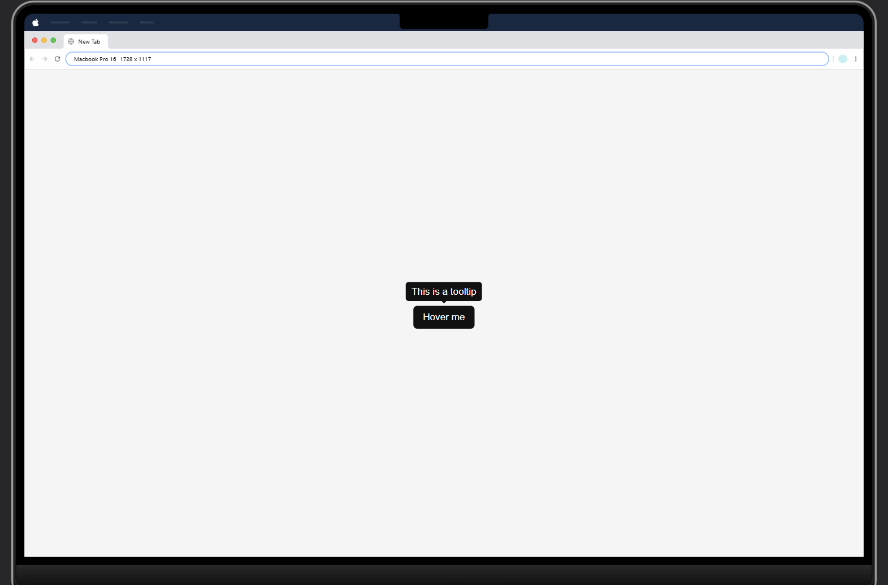

# Tooltip 

A simple tooltip component built with HTML, CSS

## Features
- Hover-based tooltip
- Smooth fade-in animation
- Clean and minimal design

## Screenshot

## What I Learned
- Positioning elements with CSS
- Creating hover-based interactions
- Building reusable UI components
